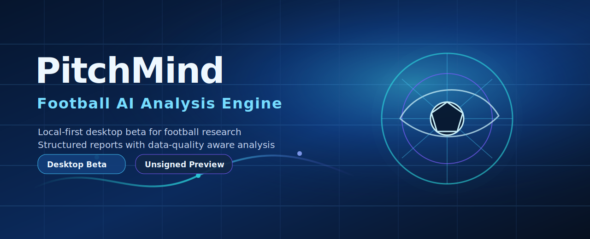

[English](README.md) / [简体中文](docs/i18n/README.zh-CN.md) / [日本語](docs/i18n/README.ja.md) / [한국어](docs/i18n/README.ko.md)

# PitchMind — Football AI Analysis Engine

> Desktop unsigned Beta · Draft GitHub Release workflow · manual GitHub Release update · automatic signed updater is later. The allowlisted source artifact is `worldcup-ai-content-engine-source.tar.gz`.

**PitchMind** is a local-first desktop Beta for football match research, AI-assisted analysis, and structured report generation. It is designed for ordinary users who want a focused research workspace without sending private tokens or local run data to a hosted service.

> Compliance boundary: PitchMind is for research and entertainment. It is not betting advice, financial advice, or a promise of match outcomes.

## Download the Desktop Beta

**Latest Beta:** [`desktop-beta-4`](https://github.com/0801ljw/football-ai-analysis-engine/releases/tag/desktop-beta-4)

| Platform | Status | Asset |
| --- | --- | --- |
| Windows x64 | Available | `PitchMind-Setup-x64.exe` |
| macOS Apple Silicon | Available | `PitchMind-macOS-AppleSilicon.dmg` |
| macOS Intel | Not yet available | No Intel DMG in this release |

The Beta is unsigned. Your operating system may show a security warning during installation. Only download from the official GitHub Release above, and do not install files from mirrors or reuploads.

## What you can do

| Area | What PitchMind helps with |
| --- | --- |
| Match research | Organize football match numbers, source status, and analysis runs in one local workspace. |
| AI-assisted reports | Generate structured football analysis reports with data-quality notes and compliance reminders. |
| Run history | Review previous runs, statuses, exported artifacts, and prediction JSON when available. |
| Local-first workflow | Keep configuration, tokens, and generated run files on your own machine. |
| Safety boundaries | Surface unsigned Beta guidance and remind users that outputs are for research and entertainment only. |

## Quick start in 3 steps

1. Open the [`desktop-beta-4` release page](https://github.com/0801ljw/football-ai-analysis-engine/releases/tag/desktop-beta-4) and download the installer for your platform.
2. Install and launch PitchMind. Because this is an unsigned Beta, approve the operating-system warning only if the file came from the official release page.
3. Create a local run, inspect the data-quality notes, and export the available artifacts if you need to share your research.

## Privacy and local-first use

- PitchMind is intended to run locally on your computer.
- Do not send API tokens, account tokens, `.env` files, local databases, or run artifacts to anyone when asking for support.
- Browser or desktop token inputs are for your local workflow. Treat tokens as secrets.
- This README does not claim remote telemetry, cloud sync, or automatic update behavior.

## Unsigned Beta safety notice

The current desktop Beta is not code-signed and does not claim automatic updates. Security prompts from Windows or macOS are expected for unsigned preview software. If you are uncomfortable with that, wait for a signed release.

## Feedback and issues

Please report bugs, installation problems, and usability feedback in [GitHub Issues](https://github.com/0801ljw/football-ai-analysis-engine/issues). Include your operating system, the downloaded asset name, and a description of what happened. Do not include tokens or private local data.

## Technology stack

| Layer | Stack |
| --- | --- |
| Desktop shell | Tauri |
| Local web app | FastAPI, Jinja2 |
| Frontend assets | HTML, CSS, JavaScript |
| Runtime and tooling | Python, SQLite, PyInstaller sidecar, release packaging scripts |
| Release target | GitHub Releases, manual unsigned Beta distribution |

## Developer entry points

This landing page is user-focused. The original developer README has been preserved without rewriting:

- [Developer documentation](docs/DEVELOPMENT.md)
- [Desktop Beta install notes](desktop/INSTALL_BETA.md)
- [Release checklist](RELEASE_CHECKLIST.md)
- [Desktop source README](desktop/README.md)

## Legal and compliance reminder

PitchMind provides football data research, probability-style exploration, and content-production assistance for entertainment and study. It does not provide betting advice, guaranteed predictions, or instructions to place wagers. Always follow your local laws and platform rules.
