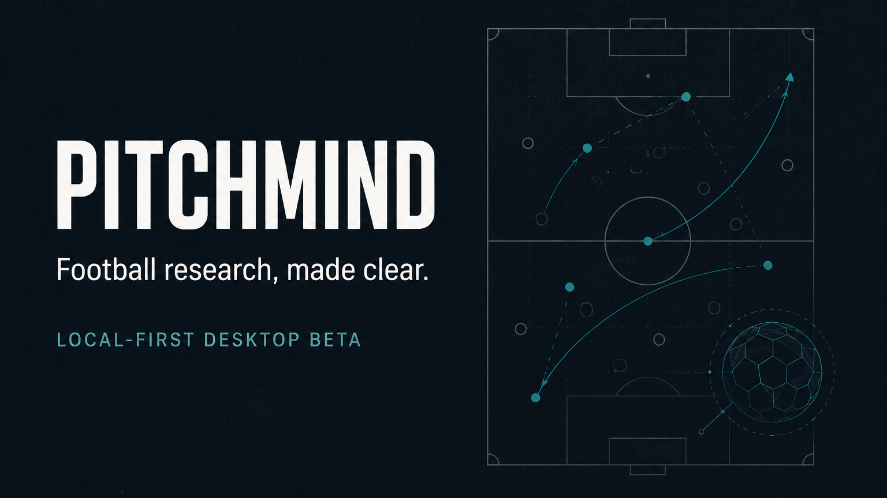
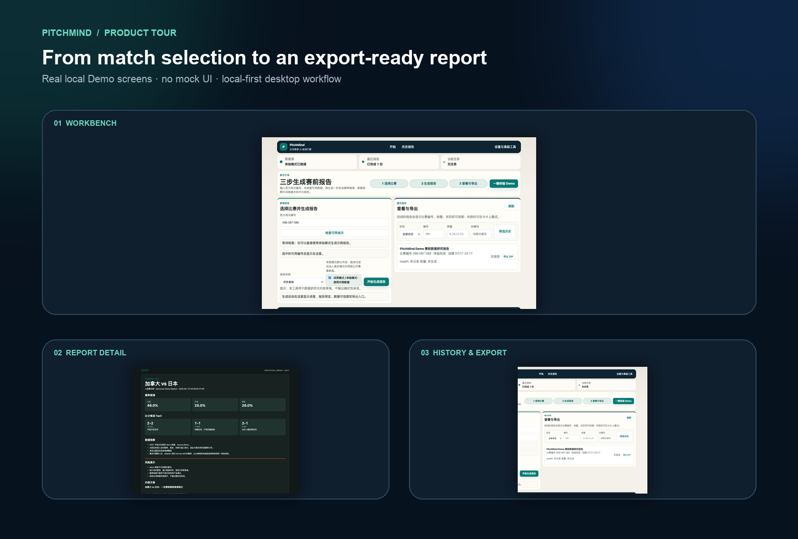
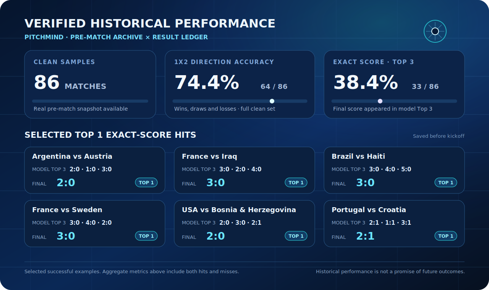

[English](../../README.md) / [简体中文](README.zh-CN.md) / [日本語](README.ja.md) / [한국어](README.ko.md)

# PitchMind — Football AI Analysis Engine

**PitchMind は、サッカーの試合リサーチを local-first のデスクトップワークフローにまとめます。試合コンテキストの収集、AI 支援分析、根拠確認、レポートのエクスポートを、プライベートな token やローカルの run データをホスト型プロダクトへ送らずに進められます。**

[公開 Beta 4 をダウンロード](https://github.com/0801ljw/football-ai-analysis-engine/releases/tag/desktop-beta-4) · [プロダクトツアー](#プロダクトツアー) · [開発者ドキュメント](../DEVELOPMENT.md)

> コンプライアンス上の境界：PitchMind は研究、学習、エンターテインメント用途のツールです。賭けの助言、金融上の助言、試合結果の保証ではありません。

## 利用可能なデスクトップ Beta

**最新の公開プレリリース:** [`desktop-beta-4`](https://github.com/0801ljw/football-ai-analysis-engine/releases/tag/desktop-beta-4)

**最新の自動 CI Draft:** `desktop-beta-8` は Draft リリース自動化の証跡であり、一般ユーザー向けの通常ダウンロード入口ではありません。

| プラットフォーム | 状態 | 公開 Beta 4 アセット |
| --- | --- | --- |
| Windows x64 | 利用可能 | `PitchMind-Setup-x64.exe` |
| macOS Apple Silicon | 利用可能 | `PitchMind-macOS-AppleSilicon.dmg` |
| macOS Intel | 利用可能 | `PitchMind-macOS-Intel.dmg` |

この Beta は未署名です。インストール時に OS のセキュリティ警告が表示される場合があります。上記の公式 GitHub Release からのみダウンロードし、利用できる場合はアセット名とチェックサムを確認してください。ミラーや再アップロードされたファイルはインストールしないでください。

## プロダクトツアー

## 3 ステップで始める

1. [`desktop-beta-4` リリースページ](https://github.com/0801ljw/football-ai-analysis-engine/releases/tag/desktop-beta-4)を開き、自分のプラットフォーム向けインストーラーをダウンロードします。
2. PitchMind をインストールして起動します。未署名 Beta のため、ファイルが公式リリースページから取得したものだと確認できる場合のみ OS の警告を許可してください。
3. ローカル run を作成し、データ品質メモとレポートを確認します。研究結果を共有する必要があれば、利用可能な artifact をエクスポートします。

## 主な機能

| 領域 | PitchMind が支援する内容 |
| --- | --- |
| 試合リサーチ | サッカーの試合番号、データソースの状態、分析 run を 1 つのローカルワークスペースで整理できます。 |
| AI 支援レポート | 根拠メモ、利用可能な prediction JSON、コンプライアンス注意を含む、構造化されたサッカー分析レポートを生成できます。 |
| Run 履歴とエクスポート | 過去の run、ステータス、レポート artifact、エクスポート可能な出力を確認できます。 |
| local-first プライバシー | 設定、token、ローカルデータベース、生成された run ファイルを自分のマシン上に保持できます。 |
| 安全上の境界 | 未署名 Beta の状態と研究用途限定であることを、プロダクトの流れの中で明確にします。 |

## 検証済みの過去実績

以下は、102 件の raw ledger から 86 件の clean な試合前サンプルを抽出して再構成した評価値です。1X2 精度は clean セットを使用しています。正確なスコア Top 3 カバー率は、過去の `lh`/`la` 値を現在の `score_matrix` 採点方法で再計算したものです。これはモデル評価の証拠であり、将来の結果を保証するものではありません。

| 評価セット | 結果 |
| --- | ---: |
| Raw ledger エントリー | 102 試合 |
| Clean な試合前サンプル | 86 試合 |
| 1X2 方向精度 | **64/86（74.4%）** |
| 正確なスコア Top 3 カバー率 | **33/86（38.4%）** |

キックオフ前に保存された正確なスコアの的中例：

| 試合 | 試合前モデルスコア | 最終スコア | 的中 |
| --- | --- | ---: | --- |
| アルゼンチン vs オーストリア | **2-0** / 1-0 / 3-0 | **2-0** | Top 1 |
| フランス vs イラク | **3-0** / 2-0 / 4-0 | **3-0** | Top 1 |
| ブラジル vs ハイチ | **3-0** / 4-0 / 5-0 | **3-0** | Top 1 |
| フランス vs スウェーデン | **3-0** / 4-0 / 2-0 | **3-0** | Top 1 |
| アメリカ vs ボスニア・ヘルツェゴビナ | **2-0** / 3-0 / 2-1 | **2-0** | Top 1 |
| ポルトガル vs クロアチア | **2-1** / 1-1 / 3-1 | **2-1** | Top 1 |
| スペイン vs オーストリア | 2-0 / **3-0** / 1-0 | **3-0** | Top 3 |
| スイス vs アルジェリア | 1-1 / 2-1 / **2-0** | **2-0** | Top 3 |

上記は成功例を選んだものです。エンジンの評価には、的中と不的中の両方を含む集計値を使用してください。

## リリース品質の証拠

| 証拠 | 状態 |
| --- | --- |
| 自動テスト | リリース品質ゲートで 146 件のテストが通過。 |
| ネイティブデスクトップ CI | Windows x64、macOS Apple Silicon、macOS Intel の 3 つのリリースジョブがプラットフォーム別インストーラーを生成します。 |
| リリースアセット | 公開 Beta 4 はインストーラーを提供し、リリースページに `SHA256SUMS.txt` などのチェックサム/リリース資料が添付されます。 |
| local-first 境界 | 現在の未署名 Beta 段階では、クラウド同期、リモートテレメトリー、自動署名アップデートを主張しません。 |

## プライバシーと未署名 Beta の安全

- PitchMind は自分のコンピューター上でローカルに動作することを意図しています。
- サポートを求める際も、API token、アカウント token、`.env` ファイル、ローカルデータベース、run artifact を送らないでください。
- ブラウザーまたはデスクトップの token 入力は、あなたのローカルワークフローのためのものです。token は秘密情報として扱ってください。
- 現在のデスクトップ Beta はコード署名されておらず、自動更新も主張していません。未署名のプレビューソフトウェアが不安な場合は、署名済みリリースをお待ちください。

## フィードバック

バグ、インストール上の問題、使い勝手に関するフィードバックは [GitHub Issues](https://github.com/0801ljw/football-ai-analysis-engine/issues) に投稿してください。OS、ダウンロードしたアセット名、発生した内容を含めてください。token やローカルの個人データは含めないでください。

## 技術と開発者向け入口

| レイヤー | スタック |
| --- | --- |
| デスクトップシェル | Tauri |
| ローカル Web アプリ | FastAPI, Jinja2 |
| フロントエンド資産 | HTML, CSS, JavaScript |
| ランタイムとツール | Python, SQLite, PyInstaller sidecar, リリース用パッケージングスクリプト |
| リリース先 | GitHub Releases、手動の未署名 Beta 配布 |

開発者向け入口：

- [開発者ドキュメント](../DEVELOPMENT.md)
- [デスクトップ Beta インストールノート](../../desktop/INSTALL_BETA.md)
- [リリースチェックリスト](../../RELEASE_CHECKLIST.md)
- [デスクトップソース README](../../desktop/README.md)

## 法務・コンプライアンス上の注意

PitchMind は、サッカーデータの研究、確率的な探索、コンテンツ制作支援を、エンターテインメントと学習のために提供します。賭けの助言、予測の保証、賭けを行うための指示は提供しません。常に居住地域の法律と利用するプラットフォームのルールに従ってください。
